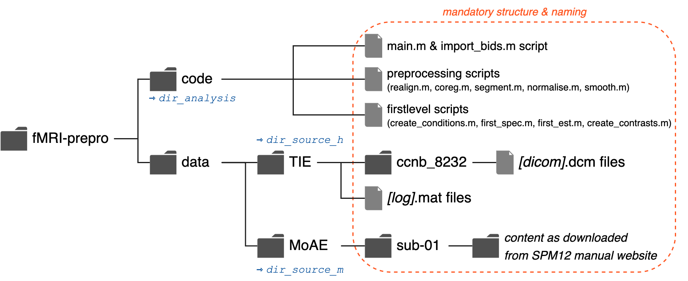

# fMRI-prepro
Final Partner Assignment for a course in our masters program Cognitive Neuroscience at FU, Berlin. 
The task is to automatise preprocessing and first level analysis of fMRI data for two different example datasets with MATLAB SPM12. 

## :file_folder: The Datasets
The first dataset is an auditory fMRI dataset that is covered in the SPM12 Manual as example for fMRI processing and is openly available [here](http://www.fil.ion.ucl.ac.uk/spm/data/auditory/).
It was conducted by Geraint Rees and is known in the respective lab as "Mother of All Experiments" (MoAE). The dataset consists of one exemplary participant, who was presented with auditory binaural stimulation while laying in a 2T MRI scanner. Therefore, the data of the one participant consists of one functional run (with alternating blocks of rest and stimulation) and one anatomical T1-weighted image. For more details please have a look [here](https://www.fil.ion.ucl.ac.uk/spm/doc/spm12_manual.pdf).

The second dataset is a fMRI dataset from an experimental study on tactile imagery conducted at the FU, Berlin. The dataset consists of one exemplary participants' data in dicom format and it is not publicly available. 
In the experiment, the participant completed different trials, where their tactile sense was either stimulated (condition 1) with one of three different stimulus types (levels: vibration, pressure, flutter) or they were asked to imagine a stimulation of their tactile system (on one of the same three levels; condition 2). Additionally, there were attention trials presented (condition 3). The experiment was conducted with six different runs, resulting in six functional scans and one T1-weighted image for the participant.  

## :question: The Task
The Assignment for the course consists of two subtasks.
In the first, we are supposed to automatise the preprocessing and first level specification and estimation of the MoAE experimental data which was covered exemplary in the SPM12 manual. 
For the second, we were asked to compile a set of scripts which automatically perform the preprocessing steps Realignment, Coregistration, Segmentation, Normalisation and Smoothing on the fMRI data. Additionally, we should generate a first level GLM (a Design-Matrix for the experiment) as well as define and estimate several contrasts. 

## :exclamation: The Solution
We decided to combine the subtasks to a degree in which we will only need one main script (```main.m```) which allows the user to specify their own paths and to choose between running subtask 1 or subtask 2 analysis. In this way, we keep redundancy in the code to a minimum and ensure that users have to manually adapt as little as possible. To run the code the folder structure should look like similar to this:


The script ```main.m```:

1. Asks for user input on which paths to use (analysis, data, and where spm toolbox is stored)
2. Asks for user input on which experiment to analyse (MoAE with code 'm' and Tactile Imagery with code 'h')
3. Initialises the respective parameters necessary for processing
4. In the case of Tactile Imagery: converts the dicom data into BIDS format using ```import_bids.m```
5. Runs Preprocessing for all participants modularised (with each step in a function)
6. Runs First-Level Analysis for all participant modularised

The Preprocessing consists of the following functions:

1. ```realign.m```: realigns functional images for each run
2. ```coreg.m```: coregisters functional and anatomical images
3. ```segment.m```: segments T1w image of participant using SPM's tissue priors
4. ```normalise.m```: normalises each run's functional (& per default anatomical) images
5. ```smooth.m```:  smoothes functional images

The First-Level Analysis consists of the following functions:

1. ```create_conditions.m```: This is only used and specifically coded for the Tactile Imagery Experiment. Since MoAE is lower in complexity, the conditions file is created in ```main.m``` directly 
2. ```spec_first.m```: specifies the design matrix (SPM.mat) using the conditions file and (if desired) using the motion regressors from realignment preprocessing step
3. ```est_first.m```: estimates the specified first level design
4. ```create_contrasts.m```: This is also used specifically for Tactile Imagery, since the MoAE did not require it. It creates the contrasts using SPM12 that can be assessed later

